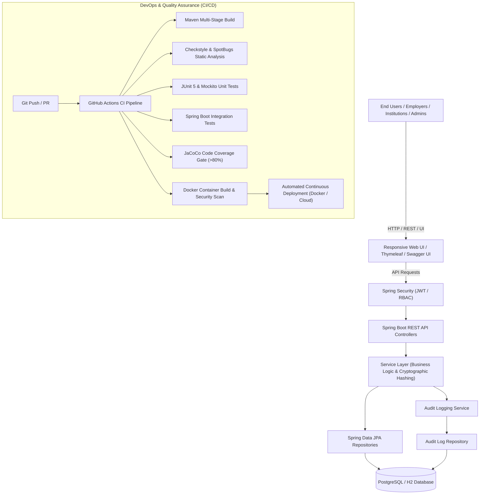

# Implementation Plan: DevOps-Enabled Qualification Verification System (Java Spring Boot)

Design and implement an enterprise-grade, DevOps-enabled **Qualification Verification System** using **Java Spring Boot**, containerization, automated CI/CD pipelines, cryptographic verification, and comprehensive software quality assurance practices according to the 100-mark assignment specification (+ bonus features).

---

## 1. System Architecture & Tech Stack



### Core Technologies
- **Backend Framework**: Java 17/21, Spring Boot 3.x (Spring Web, Spring Data JPA, Spring Security, Validation, Actuator).
- **Database**: PostgreSQL (Production/Docker) with H2 (In-memory testing & seamless local execution).
- **Security & RBAC**: JWT Authentication with three role levels:
  - `ROLE_ADMIN`: System administration, user/institution management, full audit inspection.
  - `ROLE_INSTITUTION`: Register, update, and manage academic credentials and certificates.
  - `ROLE_VERIFIER` / Public: Search and verify authenticity of credentials with real-time audit generation.
- **Cryptographic Tamper-Proofing (Bonus Mark Feature)**:
  - Automated generation of SHA-256 cryptographic hash / digital signature for each issued certificate.
  - Public verification via Certificate ID, Verification Code, or QR Code payload.
- **Auditing & Traceability**:
  - Event-driven logging for every verification request (verifier IP, user agent, timestamp, qualification queried, verification outcome).
- **DevOps & CI/CD**:
  - **Version Control**: Git branching strategy (`main`, `develop`, `feature/*`), PR review templates, issue templates.
  - **CI/CD Pipeline**: GitHub Actions for build, test, JaCoCo coverage enforcement, linting, dockerization.
  - **Containerization**: Multi-stage `Dockerfile` and `docker-compose.yml` for single-command deployment with PostgreSQL & Prometheus/Actuator metrics.
  - **API Documentation**: OpenAPI / Swagger UI (`springdoc-openapi`).

---

## 2. Proposed Project Structure & Files

The project will be built in:
`C:\Users\Madziva\.gemini\antigravity\scratch\qualification-verification-system`

### Proposed File Tree

```
qualification-verification-system/
├── .github/
│   ├── workflows/
│   │   └── ci-cd.yml                     # Full GitHub Actions CI/CD Pipeline
│   ├── ISSUE_TEMPLATE/
│   │   ├── bug_report.md
│   │   └── feature_request.md
│   ├── PULL_REQUEST_TEMPLATE.md          # Collaborative PR template
│   └── CODEOWNERS
├── src/
│   ├── main/
│   │   ├── java/com/devops/qvs/
│   │   │   ├── QualificationVerificationApplication.java
│   │   │   ├── config/                   # Security, Swagger, Audit & Web config
│   │   │   │   ├── SecurityConfig.java
│   │   │   │   ├── JwtAuthenticationFilter.java
│   │   │   │   ├── OpenApiConfig.java
│   │   │   │   └── AuditConfig.java
│   │   │   ├── controller/               # REST Endpoints
│   │   │   │   ├── AuthController.java
│   │   │   │   ├── QualificationController.java
│   │   │   │   ├── VerificationController.java
│   │   │   │   ├── AuditLogController.java
│   │   │   │   └── DashboardWebController.java
│   │   │   ├── dto/                      # Data Transfer Objects & Requests/Responses
│   │   │   │   ├── AuthRequest.java
│   │   │   │   ├── AuthResponse.java
│   │   │   │   ├── QualificationRequest.java
│   │   │   │   ├── QualificationResponse.java
│   │   │   │   ├── VerificationRequest.java
│   │   │   │   └── VerificationResultDto.java
│   │   │   ├── model/                    # JPA Entities
│   │   │   │   ├── User.java
│   │   │   │   ├── Role.java
│   │   │   │   ├── Institution.java
│   │   │   │   ├── Qualification.java
│   │   │   │   └── AuditLog.java
│   │   │   ├── repository/               # Spring Data Repositories
│   │   │   │   ├── UserRepository.java
│   │   │   │   ├── InstitutionRepository.java
│   │   │   │   ├── QualificationRepository.java
│   │   │   │   └── AuditLogRepository.java
│   │   │   ├── service/                  # Business Logic & Security/Hashing
│   │   │   │   ├── AuthService.java
│   │   │   │   ├── QualificationService.java
│   │   │   │   ├── VerificationService.java
│   │   │   │   ├── AuditLogService.java
│   │   │   │   └── CryptoHashService.java
│   │   │   └── exception/                # Global Exception Handling
│   │   │       ├── GlobalExceptionHandler.java
│   │   │       └── ResourceNotFoundException.java
│   │   └── resources/
│   │       ├── application.yml           # Base configuration
│   │       ├── application-dev.yml       # Dev / H2 profile
│   │       ├── application-prod.yml      # Prod / PostgreSQL profile
│   │       ├── static/                   # Frontend assets (CSS, JS, Icons)
│   │       └── templates/                # Web UI (Interactive Verification Portal & Dashboard)
│   │           ├── index.html            # Public verification portal
│   │           ├── dashboard.html        # Institution & Admin qualification management
│   │           ├── login.html            # Authentication UI
│   │           └── audit.html            # Real-time verification audit trail
│   └── test/
│       ├── java/com/devops/qvs/
│       │   ├── controller/               # MockMvc Controller Tests
│       │   ├── service/                  # Mockito Unit Tests
│       │   ├── repository/               # DataJpa Integration Tests
│       │   └── e2e/                      # End-to-End Verification Pipeline Tests
├── Dockerfile                            # Multi-stage optimized Docker build
├── docker-compose.yml                    # App + PostgreSQL orchestration
├── pom.xml                               # Maven config (JaCoCo, Checkstyle, Spring Boot)
├── checkstyle.xml                        # Static code quality rules
├── README.md                             # Comprehensive project documentation
└── docs/                                 # Academic deliverables documentation
    ├── TECHNICAL_REPORT_TEMPLATE.md      # 3,000-4,000 word report structure & guide
    ├── VIVA_DEMO_SCRIPT.md               # 10-15 min demonstration script & slides outline
    └── INDIVIDUAL_CONTRIBUTION_GUIDE.md  # Template for individual student contribution reports
```

---

## 3. Detailed Component Plan

### A. Core Functional Features
1. **Qualification Registration**:
   - Fields: Student Full Name, Student ID/National ID, Institution Name, Qualification Title (e.g., BSc Computer Science), Award Date, Classification/Grade, Serial Number, Cryptographic Hash.
   - Secure generation of immutable SHA-256 digital fingerprint calculated from student ID + degree + institution + award date + secret salt.
2. **Search & Retrieval**:
   - Filter by Student Name, Student ID, Certificate Serial Number, or Issuing Institution.
   - Paginated, secure search API with role-based visibility.
3. **Qualification Verification**:
   - Public-facing verification endpoint (no login required for employers, or authenticated verifier role).
   - Allows instant verification by entering Certificate Serial Number or Hash code.
   - Returns verification status: `GENUINE_AND_VALID`, `REVOKED`, `SUSPICIOUS_OR_MODIFIED`, or `NOT_FOUND`.
4. **Auditable Verification History**:
   - Every verification inquiry creates an immutable `AuditLog` entry.
   - Logs verifier IP address, timestamp, query parameters, target qualification, and verification outcome.
   - Exportable audit trail for institutional compliance.

### B. DevOps & CI/CD Implementation
1. **Continuous Integration**:
   - Automated compile and build upon pull request or push to `main` / `develop`.
   - **Static Analysis**: Enforces `checkstyle` coding standards and `SpotBugs` bug detection.
   - **Automated Testing**: Executes full unit test suite (JUnit 5 + Mockito) and integration tests.
   - **Quality Gate**: JaCoCo calculates code coverage and fails the build if code coverage falls below threshold (e.g., 80%).
2. **Continuous Delivery**:
   - Automated multi-stage Docker build packaging the Spring Boot jar into a slim JRE 17 container.
   - Container vulnerability scanning.
   - Automated tagging and deployment readiness.
3. **Collaboration Workflow**:
   - GitHub PR template with required checklist (unit tests passed, documentation updated, code review sign-off).
   - Issue templates for bug tracking and user story implementation.

### C. Advanced & Bonus Features (Targeting 10/10 Bonus Marks)
1. **Tamper-Evident Digital Certificate Cryptography**:
   - SHA-256 cryptographic hashing + verification digest matching.
2. **Real-time Monitoring & Health Dashboard**:
   - Spring Boot Actuator integrated metrics (`/actuator/health`, `/actuator/metrics`).
   - Clean UI view of system health and verification statistics.
3. **Infrastructure as Code**:
   - Fully automated `docker-compose.yml` with health checks, persistent volumes, environment separation.

---

## 4. Academic Deliverables & Reports Package

To ensure full marks on the submission criteria (Technical Report 25%, Viva 15%, Contribution Report 15%, Git Repo 20%, Software System 25%):
1. **Technical Report Draft / Guide (`docs/TECHNICAL_REPORT_TEMPLATE.md`)**:
   - Fully structured around the required 3,000-4,000 word specification covering:
     1. Executive Summary & Problem Analysis
     2. System Requirements & Functional / Non-Functional Specifications
     3. System Architecture & Architectural Decision Records (ADRs)
     4. DevOps Workflow (Git branching, CI/CD pipeline design, quality gates)
     5. Software Quality Assurance & Verification Strategy (TDD, JaCoCo, Checkstyle)
     6. Deployment & Containerization Strategy
     7. Critical Evaluation, Security Analysis & Limitations
2. **Viva & Demonstration Script (`docs/VIVA_DEMO_SCRIPT.md`)**:
   - Step-by-step timing, speaking notes, and visual demonstration guide for the 10-15 minute presentation covering code, Git branching, CI/CD pipeline execution, live verification, and audit logs.
3. **Individual Contribution Report Template (`docs/INDIVIDUAL_CONTRIBUTION_GUIDE.md`)**:
   - Template for team members to record their commits, PR reviews, role breakdown, challenges encountered, and reflections.

---

## 5. Verification & Testing Plan

### Automated Tests:
- **Unit Tests**:
  - `CryptoHashServiceTest`: Test hashing consistency, tamper detection, salt security.
  - `QualificationServiceTest`: Test registration validation, duplicate prevention, retrieval logic.
  - `VerificationServiceTest`: Test genuine, revoked, altered, and not-found scenarios.
  - `AuditLogServiceTest`: Test audit creation upon verification queries.
- **Integration Tests**:
  - `AuthControllerIntegrationTest`: User registration and JWT authentication lifecycle.
  - `QualificationControllerIntegrationTest`: Full REST API test with MockMvc.
  - `VerificationControllerIntegrationTest`: End-to-end verification endpoint with mock data.
- **Maven Commands to Verify**:
  - `mvn clean test` (Run unit and integration tests)
  - `mvn checkstyle:check` (Verify code styling compliance)
  - `mvn jacoco:report` (Generate HTML coverage reports)
  - `mvn package` (Full build with quality gates)
  - `docker compose up --build` (Multi-container deployment test)

---

## User Review Required

> [!IMPORTANT]
> **Tech Stack Confirmation**: We will build the project using **Java 17/21** and **Spring Boot 3.x** with a complete Maven build, automated GitHub Actions CI/CD pipeline, JUnit 5/Mockito test suite, Docker containerization, responsive verification web UI, and academic report documentation.

Please review this plan and let me know if you would like any adjustments or if you are ready to proceed with implementation!
