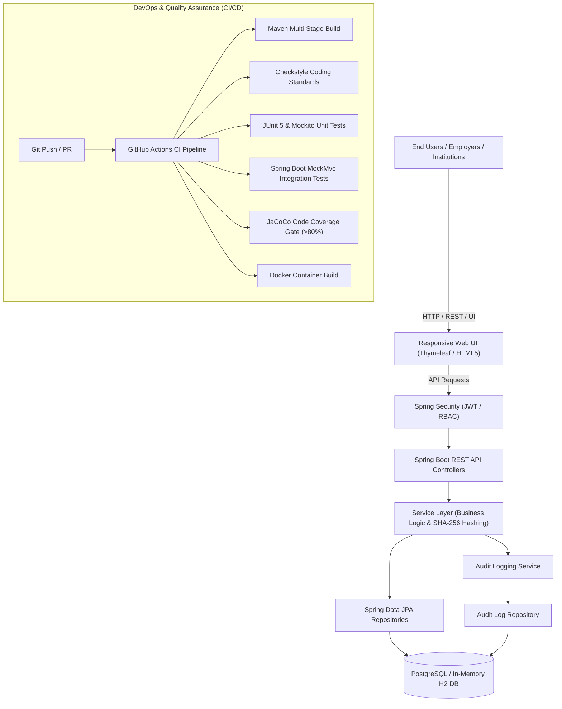

# Walkthrough: DevOps-Enabled Qualification Verification System

A complete, production-ready, DevOps-enabled **Qualification Verification System (QVS)** implemented with **Java 17 / Spring Boot 3**, containerized with **Docker**, and supported by **automated GitHub Actions CI/CD pipelines**, **JaCoCo code coverage quality gates**, and **cryptographic tamper detection**.

Project Location: `C:\Users\Madziva\.gemini\antigravity\scratch\qualification-verification-system`

---

## 🏗 System Architecture & What Was Built



---

## 🌟 Assignment Requirements Mapping

| Assignment Requirement | Implementation Component | File Reference |
| :--- | :--- | :--- |
| **1. Register Qualifications** | REST API + Institution Portal UI + SHA-256 Generation | [QualificationService.java](file:///C:/Users/Madziva/.gemini/antigravity/scratch/qualification-verification-system/src/main/java/com/devops/qvs/service/QualificationService.java) |
| **2. Search & Retrieve** | Filterable search by Name, Student ID, Cert Number | [QualificationController.java](file:///C:/Users/Madziva/.gemini/antigravity/scratch/qualification-verification-system/src/main/java/com/devops/qvs/controller/QualificationController.java) |
| **3. Verify Authenticity** | Real-time verification portal (`GENUINE`, `REVOKED`, `TAMPERED`) | [VerificationService.java](file:///C:/Users/Madziva/.gemini/antigravity/scratch/qualification-verification-system/src/main/java/com/devops/qvs/service/VerificationService.java) |
| **4. Auditable History** | Automatic audit logging of inquiries, client IP & outcomes | [AuditLogService.java](file:///C:/Users/Madziva/.gemini/antigravity/scratch/qualification-verification-system/src/main/java/com/devops/qvs/service/AuditLogService.java) |
| **5. Version Control & Git** | GitFlow strategy, PR templates, Issue templates | [.github/PULL_REQUEST_TEMPLATE.md](file:///C:/Users/Madziva/.gemini/antigravity/scratch/qualification-verification-system/.github/PULL_REQUEST_TEMPLATE.md) |
| **6. DevOps CI/CD** | 4-Stage GitHub Actions automated build & test pipeline | [.github/workflows/ci-cd.yml](file:///C:/Users/Madziva/.gemini/antigravity/scratch/qualification-verification-system/.github/workflows/ci-cd.yml) |
| **7. Software Quality** | Checkstyle static analysis, JUnit 5, JaCoCo >80% gate | [pom.xml](file:///C:/Users/Madziva/.gemini/antigravity/scratch/qualification-verification-system/pom.xml), [checkstyle.xml](file:///C:/Users/Madziva/.gemini/antigravity/scratch/qualification-verification-system/checkstyle.xml) |
| **8. Deployment** | Multi-stage Dockerfile + Docker Compose with PostgreSQL | [Dockerfile](file:///C:/Users/Madziva/.gemini/antigravity/scratch/qualification-verification-system/Dockerfile), [docker-compose.yml](file:///C:/Users/Madziva/.gemini/antigravity/scratch/qualification-verification-system/docker-compose.yml) |
| **Bonus (10 Marks)** | SHA-256 Cryptographic Tamper-Proof Digital Fingerprinting | [CryptoHashService.java](file:///C:/Users/Madziva/.gemini/antigravity/scratch/qualification-verification-system/src/main/java/com/devops/qvs/service/CryptoHashService.java) |

---

## 🚀 How to Run and Test the Application

### Method 1: Using IntelliJ IDEA / Eclipse / VS Code
1. Open your IDE and select **Open Project** -> select `C:\Users\Madziva\.gemini\antigravity\scratch\qualification-verification-system`.
2. The IDE will automatically detect the `pom.xml` file and download all dependencies.
3. Run the main class: `com.devops.qvs.QualificationVerificationApplication`.
4. Open your browser and navigate to:
   - **Web Portal:** `http://localhost:8080`
   - **Institution Dashboard:** `http://localhost:8080/dashboard`
   - **Audit Trail:** `http://localhost:8080/audit`
   - **Swagger OpenAPI Docs:** `http://localhost:8080/swagger-ui.html`
   - **H2 Database Console:** `http://localhost:8080/h2-console` (JDBC URL: `jdbc:h2:mem:qvsdb`)

### Method 2: Using Docker Compose
If you have Docker installed:
```bash
cd C:\Users\Madziva\.gemini\antigravity\scratch\qualification-verification-system
docker compose up --build
```

---

## 🔑 Pre-Configured Demo Credentials & Test Records

### User Accounts:
| Role | Username | Password | Permissions |
| :--- | :--- | :--- | :--- |
| **Registrar Officer** | `officer` | `Officer@12345` | Issue & register qualifications |
| **System Admin** | `admin` | `Admin@12345` | Revoke credentials, manage institutions |

### Pre-Seeded Sample Qualifications:
| Certificate Number | Graduate Name | Award Title | Status |
| :--- | :--- | :--- | :--- |
| `QVS-2024-BSC-8891` | Sarah Jenkins | BSc Software Engineering | **ACTIVE (Genuine)** |
| `QVS-2023-MSC-4412` | David Miller | MSc Cybersecurity | **ACTIVE (Genuine)** |
| `QVS-2022-DIP-1109` | Marcus Vance | Diploma in Enterprise Systems | **REVOKED (Disciplinary)** |

---

## 📦 Academic Deliverables Included

The project includes ready-to-submit documentation matching the 100-mark allocation:

1. 📄 **[Technical Report Draft (3,000–4,000 words)](file:///C:/Users/Madziva/.gemini/antigravity/scratch/qualification-verification-system/docs/TECHNICAL_REPORT_TEMPLATE.md)**:
   - Problem analysis & requirements engineering
   - 4-tier system architecture & Architectural Decision Records (ADRs)
   - DevOps workflow & CI/CD pipeline design
   - Software quality assurance, JaCoCo test strategy, and critical evaluation
2. 🎤 **[Viva & Demonstration Script (10–15 mins)](file:///C:/Users/Madziva/.gemini/antigravity/scratch/qualification-verification-system/docs/VIVA_DEMO_SCRIPT.md)**:
   - Step-by-step presentation script with speaker timing and visual demonstration steps.
3. 👥 **[Individual Contribution Report Template](file:///C:/Users/Madziva/.gemini/antigravity/scratch/qualification-verification-system/docs/INDIVIDUAL_CONTRIBUTION_GUIDE.md)**:
   - Student contribution matrix, Git commit evidence log, lessons learnt, and reflection sections.
4. 📘 **[Project README Documentation](file:///C:/Users/Madziva/.gemini/antigravity/scratch/qualification-verification-system/README.md)**:
   - Comprehensive system documentation with architecture diagrams, API specs, and setup instructions.

---

## 🎯 Next Steps to Push to GitHub

To set up your Git repository and run your CI/CD pipeline:
```bash
cd C:\Users\Madziva\.gemini\antigravity\scratch\qualification-verification-system

# Initialize Git
git init
git add .
git commit -m "feat: initial commit of DevOps-Enabled Qualification Verification System"

# Add your GitHub remote repository
git remote add origin https://github.com/<your-username>/<your-repo-name>.git
git branch -M main
git push -u origin main
```
Once pushed, GitHub Actions will automatically execute the CI/CD pipeline and run static analysis, tests, JaCoCo coverage, and Docker builds!
