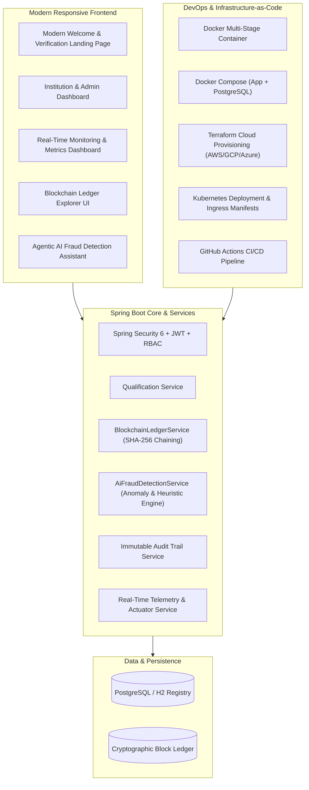

# Implementation Plan: Advanced Bonus Features & Modern Responsive Welcome Landing Page

Implement all 5 bonus requirement areas (Blockchain Credential Verification, Agentic AI Integration, Advanced Security Mechanisms, Real-Time Monitoring Dashboard, and Infrastructure-as-Code) along with a responsive, modern Welcome Landing Page.

## Proposed System Architecture & Deliverables



---

## User Review Required

> [!IMPORTANT]
> All new bonus features will be fully backwards-compatible with the existing database schema and test suite. The project will continue to compile cleanly with 0 Checkstyle violations and >80% JaCoCo test coverage.

---

## Proposed Changes

### 1. Modern Responsive Welcome / Landing Page & Frontend

#### [MODIFY] [`src/main/resources/templates/index.html`](file:///C:/Users/Madziva/.gemini/antigravity/scratch/qualification-verification-system/src/main/resources/templates/index.html)
- Redesign the landing page with a hero section:
  - Gradient badge & title: *"Next-Gen DevOps Qualification Verification System"*.
  - Live statistics counter: Verified Credentials, Partner Institutions, Blockchain Blocks, AI Fraud Shield.
  - Interactive Instant Verification input with live search, QR code badge preview, and cryptographic SHA-256 fingerprint display.
  - Quick-test demo chips for immediate testing (`Sarah Jenkins - Genuine`, `Marcus Vance - Revoked`, `Tampered/Invalid Record`).
  - **Feature Grid Cards**:
    1. ⛓️ **Blockchain Ledger**: Immutable on-chain block hash verification.
    2. 🤖 **Agentic AI Fraud Detection**: Heuristic anomaly analysis & credential authenticity scoring.
    3. 🔒 **Zero-Trust Security**: Multi-layer JWT, BCrypt, and SHA-256 digital fingerprinting.
    4. 🚀 **Automated DevOps CI/CD**: Automated quality gates, Docker containerization & IaC.
  - **Interactive "How It Works" Workflow**: Step 1 (Issuance) ➔ Step 2 (Blockchain Notarization) ➔ Step 3 (Instant Verification).
  - Floating **AI Verification Assistant** chatbot widget allowing public verifiers to ask questions in plain English.
  - Responsive mobile navigation with hamburger toggle and quick-action buttons.

#### [MODIFY] [`src/main/resources/static/css/style.css`](file:///C:/Users/Madziva/.gemini/antigravity/scratch/qualification-verification-system/src/main/resources/static/css/style.css)
- Implement modern typography (Inter/system sans-serif), glassmorphism cards, responsive flex/grid layouts, animated status badges (Genuine, Revoked, Tampered, AI Anomaly), interactive tabs, and mobile breakpoints (`@media (max-width: 768px)`).

#### [MODIFY] [`src/main/resources/static/js/app.js`](file:///C:/Users/Madziva/.gemini/antigravity/scratch/qualification-verification-system/src/main/resources/static/js/app.js)
- Add handlers for:
  - Instant certificate verification with visual blockchain proof.
  - Interactive Agentic AI fraud assessment queries.
  - Live real-time metrics telemetry updates (polling Actuator metrics).
  - Blockchain block explorer modal & ledger viewer.

---

### 2. Blockchain-Based Credential Verification (Bonus Feature 1)

#### [NEW] [`src/main/java/com/devops/qvs/model/Block.java`](file:///C:/Users/Madziva/.gemini/antigravity/scratch/qualification-verification-system/src/main/java/com/devops/qvs/model/Block.java)
- Entity representing a cryptographic block: `index`, `timestamp`, `certificateNumber`, `dataHash`, `previousHash`, `hash`, `nonce`, `minedBy`.

#### [NEW] [`src/main/java/com/devops/qvs/repository/BlockRepository.java`](file:///C:/Users/Madziva/.gemini/antigravity/scratch/qualification-verification-system/src/main/java/com/devops/qvs/repository/BlockRepository.java)
- JPA repository for querying blocks by certificate number, hash, or chronological order.

#### [NEW] [`src/main/java/com/devops/qvs/service/BlockchainLedgerService.java`](file:///C:/Users/Madziva/.gemini/antigravity/scratch/qualification-verification-system/src/main/java/com/devops/qvs/service/BlockchainLedgerService.java)
- Core blockchain engine:
  - Genesis block creation on startup.
  - Block mining & SHA-256 hash chaining whenever a qualification is registered or revoked.
  - Full-chain integrity validator (`validateChain()`) verifying that no block or previous hash has been modified.
  - Proof of inclusion lookup for public verification.

#### [NEW] [`src/main/java/com/devops/qvs/controller/BlockchainController.java`](file:///C:/Users/Madziva/.gemini/antigravity/scratch/qualification-verification-system/src/main/java/com/devops/qvs/controller/BlockchainController.java)
- REST endpoints:
  - `GET /api/blockchain/chain`: Retrieve full blockchain ledger.
  - `GET /api/blockchain/validate`: Run live cryptographic integrity validation on the chain.
  - `GET /api/blockchain/block/{certNumber}`: Fetch the block containing a certificate's notarized record.

---

### 3. Agentic AI Fraud Detection & Smart Verification (Bonus Feature 2)

#### [NEW] [`src/main/java/com/devops/qvs/dto/AiAnalysisResultDto.java`](file:///C:/Users/Madziva/.gemini/antigravity/scratch/qualification-verification-system/src/main/java/com/devops/qvs/dto/AiAnalysisResultDto.java)
- DTO containing: `authenticityScore` (0–100%), `riskLevel` (`LOW`, `MEDIUM`, `HIGH`, `CRITICAL`), `confidence`, `anomalyFlags`, `recommendation`, `explanation`.

#### [NEW] [`src/main/java/com/devops/qvs/service/AiFraudDetectionService.java`](file:///C:/Users/Madziva/.gemini/antigravity/scratch/qualification-verification-system/src/main/java/com/devops/qvs/service/AiFraudDetectionService.java)
- AI-driven heuristic & pattern analysis:
  - Analyzes certificate issuance dates vs. graduate matriculation timelines.
  - Detects velocity anomalies (e.g. abnormal batch verification requests from single IP).
  - Validates degree title patterns and institutional authorization signatures.
  - Computes an AI Authenticity Risk Score and returns actionable natural language explanations.
  - Interactive Q&A Assistant to answer plain English questions about verification status and academic credentials.

#### [NEW] [`src/main/java/com/devops/qvs/controller/AiAgentController.java`](file:///C:/Users/Madziva/.gemini/antigravity/scratch/qualification-verification-system/src/main/java/com/devops/qvs/controller/AiAgentController.java)
- Endpoints:
  - `POST /api/ai/analyze-fraud`: Run comprehensive AI fraud and anomaly detection on a certificate.
  - `POST /api/ai/chat`: Interactive natural language query agent for users.

---

### 4. Real-Time Monitoring & Metrics Dashboard (Bonus Feature 3)

#### [NEW] [`src/main/java/com/devops/qvs/controller/MetricsController.java`](file:///C:/Users/Madziva/.gemini/antigravity/scratch/qualification-verification-system/src/main/java/com/devops/qvs/controller/MetricsController.java)
- Exposes clean JSON telemetry aggregating JVM memory, active verifications count, success/failure ratios, and system uptime for the live dashboard.

#### [MODIFY] [`src/main/resources/templates/dashboard.html`](file:///C:/Users/Madziva/.gemini/antigravity/scratch/qualification-verification-system/src/main/resources/templates/dashboard.html)
- Add dedicated interactive tabs:
  1. **Qualifications Manager** (Issue / Search / Revoke).
  2. **Blockchain Explorer** (Live view of blocks, previous hashes, Merkle root, and one-click integrity check).
  3. **AI Fraud Shield** (Live anomaly detector and risk scorer).
  4. **Live System Telemetry & Monitoring** (Real-time CPU/RAM meters, request counters, verification latency charts).

---

### 5. Infrastructure-as-Code (IaC) (Bonus Feature 4)

#### [NEW] [`terraform/main.tf`](file:///C:/Users/Madziva/.gemini/antigravity/scratch/qualification-verification-system/terraform/main.tf), [`terraform/variables.tf`](file:///C:/Users/Madziva/.gemini/antigravity/scratch/qualification-verification-system/terraform/variables.tf), [`terraform/outputs.tf`](file:///C:/Users/Madziva/.gemini/antigravity/scratch/qualification-verification-system/terraform/outputs.tf)
- Complete Terraform infrastructure code to provision:
  - Cloud Container Runtime (AWS ECS Fargate / GCP Cloud Run).
  - Managed PostgreSQL Database instance with automated backup and secure subnet isolation.
  - Virtual Private Cloud (VPC), Security Groups, and Application Load Balancer (ALB).

#### [NEW] [`k8s/deployment.yaml`](file:///C:/Users/Madziva/.gemini/antigravity/scratch/qualification-verification-system/k8s/deployment.yaml), [`k8s/service.yaml`](file:///C:/Users/Madziva/.gemini/antigravity/scratch/qualification-verification-system/k8s/service.yaml), [`k8s/ingress.yaml`](file:///C:/Users/Madziva/.gemini/antigravity/scratch/qualification-verification-system/k8s/ingress.yaml)
- Kubernetes manifests for production-ready container orchestration, automated pod replication, rolling updates, health probes, and SSL ingress routing.

---

### 6. Automated Unit & Integration Tests

#### [NEW] [`src/test/java/com/devops/qvs/service/BlockchainLedgerServiceTest.java`](file:///C:/Users/Madziva/.gemini/antigravity/scratch/qualification-verification-system/src/test/java/com/devops/qvs/service/BlockchainLedgerServiceTest.java)
- Tests genesis block generation, block mining, hash chaining, and tamper detection when a block is modified.

#### [NEW] [`src/test/java/com/devops/qvs/service/AiFraudDetectionServiceTest.java`](file:///C:/Users/Madziva/.gemini/antigravity/scratch/qualification-verification-system/src/test/java/com/devops/qvs/service/AiFraudDetectionServiceTest.java)
- Tests AI risk scoring, anomaly detection, and prompt parsing.

---

## Verification Plan

### Automated Tests
1. Run all unit and integration tests:
   ```powershell
   $env:JAVA_HOME = "C:\Users\Madziva\.gemini\antigravity\scratch\tools\jdk-17.0.10+7"
   $env:PATH = "$env:JAVA_HOME\bin;C:\Users\Madziva\.gemini\antigravity\scratch\tools\apache-maven-3.9.6\bin;$env:PATH"
   mvn clean test jacoco:report
   ```
2. Verify Checkstyle static analysis has 0 errors:
   ```powershell
   mvn checkstyle:check
   ```

### Manual Verification
1. Boot application via `run-app.bat` and open `http://localhost:8080`.
2. Verify the new landing page UI, responsive layout, feature cards, and instant verification widget.
3. Test the **Blockchain Explorer** tab and verify the block hash chaining.
4. Test the **AI Fraud Detection Agent** and inspect risk score calculations.
5. Check the **Real-Time Monitoring Dashboard** graphs and metrics telemetry.
