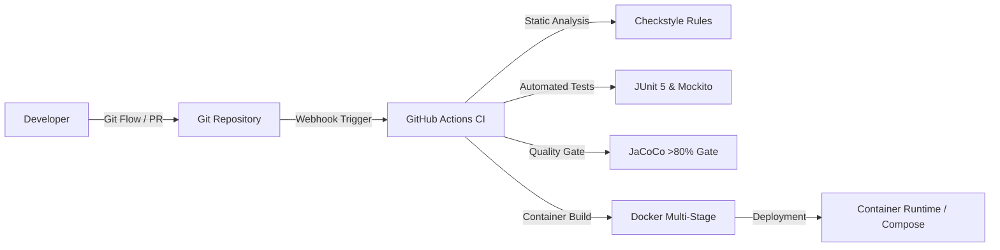

# DevOps-Enabled Qualification Verification System (QVS)

[](https://github.com)
[](https://www.oracle.com/java/)
[](https://spring.io/projects/spring-boot)
[](target/site/jacoco/index.html)
[](Dockerfile)
[](LICENSE)

An enterprise-grade, DevOps-enabled **Academic and Professional Qualification Verification System** developed with **Java Spring Boot**, containerized with **Docker**, and continuously integrated and delivered via automated **GitHub Actions CI/CD pipelines**.

---

## 📑 Table of Contents
1. [Key Features & Capabilities](#-key-features--capabilities)
2. [DevOps & Software Quality Architecture](#-devops--software-quality-architecture)
3. [System Architecture Diagram](#-system-architecture-diagram)
4. [Prerequisites & Quick Start](#-prerequisites--quick-start)
5. [Automated Testing & Quality Gates](#-automated-testing--quality-gates)
6. [CI/CD Pipeline Details](#-cicd-pipeline-details)
7. [Docker & Container Orchestration](#-docker--container-orchestration)
8. [API Documentation (OpenAPI / Swagger)](#-api-documentation-openapi--swagger)
9. [Pre-Seeded Demo Accounts](#-pre-seeded-demo-accounts)
10. [Academic Submission Deliverables](#-academic-submission-deliverables)

---

## 🌟 Key Features & Capabilities

- **Tamper-Evident Digital Fingerprinting (Bonus Feature)**: Every qualification is bound to a deterministic SHA-256 cryptographic signature that immediately detects forged or modified credential records.
- **Public & Institutional Verification Portal**: Instant, transparent credential lookup with visual genuine/revoked/tampered badges.
- **Immutable Audit Logging**: Automatic recording of all verification activities, IP addresses, client signatures, and verification outcomes for compliance and forensics.
- **Role-Based Access Control (RBAC)**: Secure JWT authentication with `ROLE_ADMIN`, `ROLE_INSTITUTION`, and `ROLE_VERIFIER`.
- **Credential Lifecycle Management**: Issue, update, search, and revoke qualifications with recorded revocation audit reasons.

---

## 🛠 DevOps & Software Quality Architecture



- **Branching Strategy**: Standard GitFlow model (`main`, `develop`, `feature/*`, `bugfix/*`).
- **Static Code Analysis**: Maven Checkstyle plugin enforcing strict Java coding standards.
- **Code Coverage Gate**: JaCoCo Maven plugin enforcing minimum line coverage thresholds.
- **Continuous Deployment**: Multi-stage, minimal attack surface JRE Docker image with non-root security execution.

---

## 🚀 Prerequisites & Quick Start

### Option 1: Run Locally with Maven & Java 17+
```bash
# Clone the repository
git clone <your-repository-url>
cd qualification-verification-system

# Run tests and verify build
mvn clean test

# Launch the Spring Boot application (Dev Profile / In-Memory H2 DB)
mvn spring-boot:run
```
The application will be accessible at: **`http://localhost:8080`**

### Option 2: Run with Docker Compose (PostgreSQL Production Setup)
```bash
docker compose up --build
```
This boots both the **Spring Boot application** and a dedicated **PostgreSQL 15** database container.

---

## 🧪 Automated Testing & Quality Gates

Run the comprehensive unit and integration test suite:
```bash
# Execute unit and integration tests
mvn clean test

# Generate JaCoCo code coverage report
mvn jacoco:report
```
*Coverage reports are generated at `target/site/jacoco/index.html`.*

Verify coding standard compliance:
```bash
mvn checkstyle:check
```

---

## 📊 Pre-Seeded Demo Accounts & Records

The system automatically initializes test accounts and sample certificates on launch:

### Demo User Accounts:
| Role | Username | Password | Purpose |
| :--- | :--- | :--- | :--- |
| **System Admin** | `admin` | `Admin@12345` | Revoke credentials, manage system |
| **Registrar Officer** | `officer` | `Officer@12345` | Issue & register new qualifications |

### Pre-Seeded Sample Qualifications:
| Certificate Number | Graduate Name | Award Title | Status |
| :--- | :--- | :--- | :--- |
| `QVS-2024-BSC-8891` | Sarah Jenkins | BSc in Software Engineering | **ACTIVE (Genuine)** |
| `QVS-2023-MSC-4412` | David Miller | MSc in Cybersecurity | **ACTIVE (Genuine)** |
| `QVS-2022-DIP-1109` | Marcus Vance | Diploma in Enterprise Systems | **REVOKED (Disciplinary)** |

---

## 📖 API Documentation (OpenAPI / Swagger)

Interactive API documentation with live execution capabilities is available at:
- **Swagger UI**: [http://localhost:8080/swagger-ui.html](http://localhost:8080/swagger-ui.html)
- **OpenAPI JSON**: [http://localhost:8080/api-docs](http://localhost:8080/api-docs)

---

## 📂 Academic Submission Deliverables

- 📄 **[Technical Report Template](docs/TECHNICAL_REPORT_TEMPLATE.md)**: Structured 3,000–4,000 word academic report template.
- 🤝 **[Git & GitHub Collaboration Guide](docs/GIT_COLLABORATION_GUIDE.md)**: Team branching strategy, PR workflow, and setup instructions.
- 🎤 **[Viva Presentation & Demo Script](docs/VIVA_DEMO_SCRIPT.md)**: 10–15 minute presentation guide with slide outline.
- 👥 **[Individual Contribution Guide](docs/INDIVIDUAL_CONTRIBUTION_GUIDE.md)**: Contribution evidence report template for team members.

