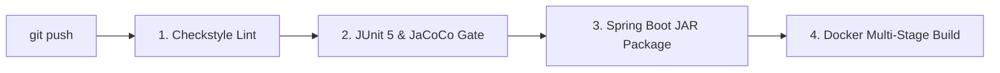

# 🤝 Team Git & GitHub Collaboration Guide

**Project:** DevOps-Enabled Qualification Verification System (QVS)  
**Target Audience:** Development Team (3–5 Members) & Collaborators

---

## 📌 Table of Contents
1. [Initial Repository Setup & Pushing to GitHub](#1-initial-repository-setup--pushing-to-github)
2. [Adding & Inviting Team Members](#2-adding--inviting-team-members)
3. [Branching Strategy (GitFlow)](#3-branching-strategy-gitflow)
4. [Step-by-Step Daily Developer Workflow](#4-step-by-step-daily-developer-workflow)
5. [Pull Request (PR) & Code Review Guidelines](#5-pull-request-pr--code-review-guidelines)
6. [Managing Merge Conflicts](#6-managing-merge-conflicts)
7. [Automated CI/CD Quality Gate Checks](#7-automated-cicd-quality-gate-checks)

---

## 1. Initial Repository Setup & Pushing to GitHub

If the project is not yet on GitHub, the **Team Lead** should follow these steps:

### Step 1.1: Initialize Local Git Repository
Open PowerShell or Terminal inside the project folder:
```bash
cd qualification-verification-system

# Initialize git tracking
git init -b main

# Stage all files
git add .

# Create initial commit
git commit -m "feat: initial project structure with Spring Boot, CI/CD, and docs"
```

### Step 1.2: Create Remote Repository on GitHub
1. Log in to [GitHub.com](https://github.com).
2. Click **New Repository** (`+` icon in top-right).
3. Name it: `qualification-verification-system` (or `devops-qualification-system`).
4. Set visibility to **Public** or **Private**.
5. Do **NOT** initialize with a README, .gitignore, or license (they are already present locally).
6. Click **Create repository**.

### Step 1.3: Link & Push Local Code
```bash
# Link your local repo to GitHub (replace with your repo URL)
git remote add origin https://github.com/<YOUR-USERNAME>/qualification-verification-system.git

# Push main branch
git push -u origin main

# Create and push develop branch
git checkout -b develop
git push -u origin develop
```

---

## 2. Adding & Inviting Team Members

To collaborate seamlessly with your 3–5 team members:

1. On GitHub, navigate to your repository -> **Settings** -> **Collaborators**.
2. Click **Add people**.
3. Enter each team member's GitHub username or email address.
4. Each member receives an email invitation or accepts at `https://github.com/<YOUR-USERNAME>/<REPO-NAME>/invitations`.
5. *(Recommended)* Set branch protection rules on `main` and `develop`:
   - Go to **Settings** -> **Branches** -> **Add rule**.
   - Branch name pattern: `main` (and another for `develop`).
   - Check:
     - ✅ **Require a pull request before merging** (Require 1 approval).
     - ✅ **Require status checks to pass before merging** (Select `test-and-coverage`, `build-and-lint`).

---

## 3. Branching Strategy (GitFlow)

To avoid code overwrites and merge chaos, follow this strict branching model:

```
[ main ]          ------------------------------------● (Release v1.0.0)
                     \                              /
[ develop ]       ----+----------------------------● (Integration)
                         \                        /
[ feature/* ]             ●----●----●------------ (Pull Request & Peer Review)
```

| Branch Name | Role / Purpose | Direct Commits Allowed? |
| :--- | :--- | :--- |
| `main` | Production-ready code | ❌ No (Only via PR from `develop`) |
| `develop` | Integration branch for all tested features | ❌ No (Only via PR from feature branches) |
| `feature/<name>` | Individual user stories / components | ✅ Yes (Assigned developer) |
| `bugfix/<name>` | Targeted defect resolution | ✅ Yes (Assigned developer) |

### Branch Naming Conventions:
- `feature/jwt-authentication`
- `feature/sha256-verification`
- `feature/thymeleaf-audit-ui`
- `feature/docker-compose-postgres`
- `bugfix/null-pointer-verification`

---

## 4. Step-by-Step Daily Developer Workflow

### For Team Members (Colleagues):

#### Step 4.1: Clone the Shared Repository
```bash
git clone https://github.com/<TEAM-LEAD-USERNAME>/qualification-verification-system.git
cd qualification-verification-system
```

#### Step 4.2: Pull Latest Changes from `develop`
Always start your work from the latest `develop` branch:
```bash
git checkout develop
git pull origin develop
```

#### Step 4.3: Create a Dedicated Feature Branch
```bash
git checkout -b feature/qualification-search
```

#### Step 4.4: Write Code & Test Locally
Make your changes, then verify that static analysis and unit tests pass before committing:
```bash
# Run unit & integration tests
mvn clean test

# Check code formatting compliance
mvn checkstyle:check
```

#### Step 4.5: Commit with Meaningful Conventional Commit Messages
Follow standard conventional commit prefixes (`feat:`, `fix:`, `test:`, `docs:`, `ci:`, `refactor:`):
```bash
git add .
git commit -m "feat(search): implement multi-parameter qualification lookup endpoint"
```

#### Step 4.6: Push Feature Branch to GitHub
```bash
git push -u origin feature/qualification-search
```

---

## 5. Pull Request (PR) & Code Review Guidelines

1. Go to your repository on GitHub.
2. You will see a banner: **`feature/qualification-search had recent pushes - Compare & pull request`**. Click **Compare & pull request**.
3. Set **Base branch:** `develop` | **Compare branch:** `feature/qualification-search`.
4. Fill out the PR template:
   ```markdown
   ## 📌 Description of Changes
   - Implemented keyword and institution-based search in `QualificationService.java`.
   - Added JUnit 5 tests covering empty results and special characters.

   ## 🧪 Quality Checklist
   - [x] Unit tests written and passing locally (`mvn test`).
   - [x] JaCoCo coverage exceeds 80%.
   - [x] Checkstyle passed without style warnings.
   - [x] No sensitive keys or passwords committed.
   ```
5. Assign at least **one peer reviewer** from your team.
6. The GitHub Actions CI/CD pipeline will automatically trigger on the PR.
7. Once the pipeline passes (green checkmark) and the reviewer approves, click **Squash and merge** or **Merge pull request**.

---

## 6. Managing Merge Conflicts

If another teammate merged changes to `develop` that conflict with your feature branch:

```bash
# 1. Switch to your feature branch
git checkout feature/qualification-search

# 2. Fetch and merge develop into your branch
git fetch origin
git merge origin/develop

# 3. Git will mark conflict files. Open them in VS Code / IDE.
# Resolve the <<<<<<< HEAD ... >>>>>>> markers.

# 4. Run tests to ensure everything compiles and passes
mvn clean test

# 5. Stage resolved files and complete the merge commit
git add .
git commit -m "merge: resolve merge conflict with develop"

# 6. Push the updated branch
git push origin feature/qualification-search
```

---

## 7. Automated CI/CD Quality Gate Checks

Every time a team member pushes a branch or opens a Pull Request, GitHub Actions automatically executes the 4 pipeline jobs defined in `.github/workflows/ci-cd.yml`:



- **If all 4 jobs pass:** The PR receives a green badge and is eligible for merge.
- **If any test or coverage check fails (<80% coverage):** The PR is blocked, preventing broken code from entering the main codebase.
