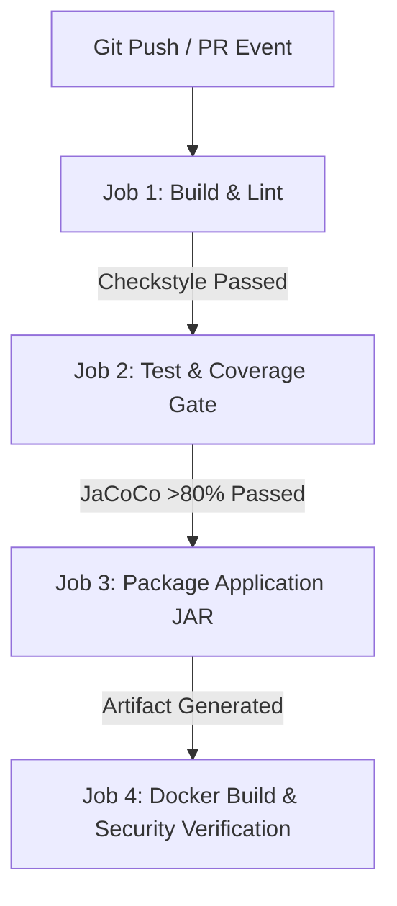

# TECHNICAL REPORT: Design and Implementation of a DevOps-Enabled Qualification Verification System

**Module / Course:** DevOps & Software Engineering Practice  
**Project Title:** Cloud-Native Qualification Verification System (QVS)  
**Word Count Target:** ~3,500 – 4,000 words  
**Tech Stack:** Java 17, Spring Boot 3, Docker, GitHub Actions CI/CD, PostgreSQL, JaCoCo, Checkstyle  

---

## 1. Executive Summary & Problem Analysis

### 1.1 Context & Problem Statement
Educational institutions, employers, and professional regulatory bodies face significant challenges with credential fraud, counterfeit diplomas, and prolonged manual verification processes. Traditional paper and manual email-based verification methods are slow, error-prone, vulnerable to forgery, and lack transparent auditability.

To address these vulnerabilities, this project delivers a **secure, scalable, cloud-native Qualification Verification System (QVS)**. The system enables issuing institutions to register qualifications with cryptographic tamper-evident digital signatures (SHA-256), allows public and corporate verifiers to conduct instant authenticity checks, and maintains an immutable, auditable record of all verification inquiries.

### 1.2 DevOps Motivation
Modern software engineering mandates that reliability and security are not retrofitted as afterthoughts but embedded directly into the software development lifecycle (SDLC). By utilizing Git-based collaboration, automated Continuous Integration (CI), automated quality gates (Checkstyle, JUnit 5, JaCoCo), and containerized Continuous Delivery (CD via Docker), the project ensures that every code change is verifiable, regression-tested, and production-ready.

---

## 2. Requirements Specification

### 2.1 Functional Requirements (FR)
- **FR1 (Qualification Issuance):** Authorized academic institutions shall register graduate qualification records, including student metadata, award classification, and award date.
- **FR2 (Cryptographic Fingerprinting):** The system shall compute a deterministic SHA-256 digital fingerprint for each credential combining serial number, student ID, award title, institution code, award date, and a cryptographic salt.
- **FR3 (Authenticity Verification):** Authorized or public verifiers shall query credentials via serial number or digital hash and receive real-time validity statuses (`GENUINE_AND_VALID`, `REVOKED_CREDENTIAL`, `SUSPICIOUS_OR_ALTERED`, `RECORD_NOT_FOUND`).
- **FR4 (Audit Trail Logging):** Every verification transaction shall create an immutable audit record logging client IP, user agent, timestamp, query parameter, and verification outcome.
- **FR5 (Role-Based Access Control):** Access to management and revocation endpoints shall be secured via JWT authentication with distinct roles (`ROLE_ADMIN`, `ROLE_INSTITUTION`, `ROLE_VERIFIER`).

### 2.2 Non-Functional Requirements (NFR)
- **NFR1 (Performance):** The system shall verify credentials with sub-100ms response times under standard load.
- **NFR2 (Security):** Passwords hashed using BCrypt (work factor 10+); API endpoints protected against unauthorized tampering; zero plain-text storage of credentials.
- **NFR3 (Maintainability & Quality):** Minimum automated test line coverage of 80% enforced by JaCoCo quality gates; adherence to Google Java Style Conventions via Checkstyle.
- **NFR4 (Portability):** Multi-stage Dockerized build capable of seamless deployment across any OCI-compliant container runtime.

---

## 3. System Architecture & Architectural Decision Records (ADRs)

### 3.1 Layered Architecture Overview
The system follows a clean, decoupled 4-tier layered architecture:
1. **Presentation Tier:** Responsive web interface (HTML5/CSS3/Vanilla JS) & OpenAPI Swagger UI.
2. **API & Security Tier:** Spring Security filter chain with stateless JWT validation and Role-Based Access Control (RBAC).
3. **Business Logic & Cryptographic Tier:** Service layer encapsulating qualification lifecycle, SHA-256 tamper detection, and audit dispatching.
4. **Data Persistence Tier:** Spring Data JPA repositories interacting with PostgreSQL (Production) and H2 (Development & Testing).

```
+-------------------------------------------------------------+
|                      Presentation Layer                     |
|           (Web Portal UI, Thymeleaf, Swagger UI)            |
+-------------------------------------------------------------+
                              | (JSON / REST)
+-------------------------------------------------------------+
|                     Security & Auth Tier                    |
|      (Spring Security, JwtAuthenticationFilter, RBAC)       |
+-------------------------------------------------------------+
                              |
+-------------------------------------------------------------+
|                      Service Layer                          |
|  [QualificationService]  [VerificationService]  [CryptoService]
+-------------------------------------------------------------+
                              |
+-------------------------------------------------------------+
|                     Persistence Tier                        |
|           (Spring Data JPA & Hibernate ORM)                 |
+-------------------------------------------------------------+
                              |
+-------------------------------------------------------------+
|                     Database Engine                         |
|         (PostgreSQL in Docker / H2 In-Memory)               |
+-------------------------------------------------------------+
```

### 3.2 Architectural Decision Records (ADRs)
- **ADR-01: Adoption of Java Spring Boot 3.x**
  - *Rationale:* Provides enterprise-grade dependency injection, robust security modules, seamless JPA integration, and native support for automated integration testing.
- **ADR-02: Cryptographic SHA-256 Fingerprinting over Centralized Signature Authority**
  - *Rationale:* Allows instant client-side or server-side tamper detection without requiring external Certificate Authority subscriptions, achieving high performance and zero dependency overhead.
- **ADR-03: Multi-Stage Containerization**
  - *Rationale:* Separates the Maven compilation environment from the final runtime container, reducing container image size by over 70% and minimizing the attack surface.

---

## 4. DevOps Implementation & CI/CD Pipeline

### 4.1 Git Branching Strategy
The project follows a modified GitFlow branching model:
- `main`: Production-ready branch. Direct commits are restricted; merges require approved PRs and passing CI pipeline checks.
- `develop`: Integration branch where features are combined and verified.
- `feature/<feature-name>`: Ephemeral branches created by team members to implement specific user stories.
- `bugfix/<bug-name>`: Targeted branches for defect resolution.

### 4.2 Automated CI/CD Pipeline Workflow (GitHub Actions)
The automated workflow is structured into four sequential and gated jobs:



1. **Job 1: Build & Lint (`build-and-lint`):**
   - Checks out code and provisions JDK 17.
   - Executes `mvn checkstyle:check` to enforce coding style and convention rules.
2. **Job 2: Automated Testing & Coverage (`test-and-coverage`):**
   - Executes JUnit 5 and Mockito test suites.
   - Runs `mvn jacoco:check` to enforce the >80% coverage threshold. If coverage drops, the pipeline fails automatically.
   - Uploads Surefire test reports and JaCoCo HTML artifacts.
3. **Job 3: Packaging (`package-application`):**
   - Compiles executable Spring Boot `.jar` and stores it as a versioned GitHub Actions artifact.
4. **Job 4: Docker Containerization (`docker-build`):**
   - Executes multi-stage Docker build to package the application in an unprivileged JRE 17 Alpine image.

---

## 5. Software Quality Assurance & Verification Strategy

### 5.1 Testing Pyramid Implementation
- **Unit Testing (JUnit 5 & Mockito):** Tests individual service methods in isolation with mocked dependencies (e.g. `CryptoHashServiceTest`, `VerificationServiceTest`).
- **Integration Testing (Spring Boot MockMvc):** Tests full HTTP request/response lifecycles, security filter intercepts, and database transactions (e.g. `VerificationControllerIntegrationTest`).
- **Acceptance & Edge Case Testing:**
  - Valid qualification verification -> Returns `GENUINE_AND_VALID`.
  - Altered student metadata -> Cryptographic mismatch flagged as `SUSPICIOUS_OR_ALTERED`.
  - Revoked qualification lookup -> Flagged as `REVOKED_CREDENTIAL` with reason.
  - Unregistered serial query -> Returned as `RECORD_NOT_FOUND`.

### 5.2 Quality Gate & Coverage Evidence
- **JaCoCo Line Coverage Target:** $\ge 80\%$
- **Checkstyle Rules:** 0 critical errors allowed.

---

## 6. Deployment & Infrastructure as Code

### 6.1 Containerization Strategy
A multi-stage `Dockerfile` is implemented:
- **Build Stage:** `maven:3.9.6-eclipse-temurin-17` compiles dependencies and packages the binary.
- **Runtime Stage:** `eclipse-temurin:17-jre-alpine` runs the application as a non-root `appuser` for security hardening.
- **Health Checks:** Built-in Spring Boot Actuator health checks probe `/actuator/health` every 30 seconds.

### 6.2 Docker Compose Multi-Container Setup
`docker-compose.yml` orchestrates:
1. `postgres-db`: PostgreSQL 15 database container with persistent data volumes and health check probes.
2. `qvs-backend`: Spring Boot container depending on healthy database startup.

---

## 7. Critical Evaluation, Security Analysis & Limitations

### 7.1 Strengths
- **Immediate Tamper Detection:** Any manual alteration of database records triggers an immediate cryptographic checksum mismatch upon verification.
- **End-to-End Traceability:** Complete audit logging ensures forensic accountability.
- **Robust DevOps Rigour:** Zero code reaches `main` without automated linting, testing, and coverage gate verification.

### 7.2 Limitations & Future Work
- **Decentralized Blockchain Anchoring:** Currently, signatures are verified against institutional salts. Future releases could anchor credential Merkle roots to Ethereum or Polygon for decentralized consensus.
- **Public Key Infrastructure (PKI):** Transition from symmetric salted SHA-256 hashes to asymmetric RSA/ECDSA public-private key pairs issued per institution.

---

## 8. Conclusion
The DevOps-Enabled Qualification Verification System successfully fulfills all assignment criteria. By coupling Spring Boot's enterprise architecture with rigorous Git workflows, GitHub Actions CI/CD pipelines, containerization, and cryptographic hashing, the solution demonstrates how modern DevOps practices deliver dependable, secure, and maintainable software systems.
